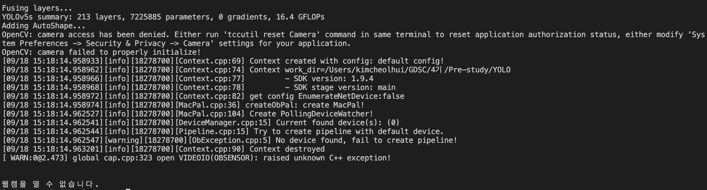
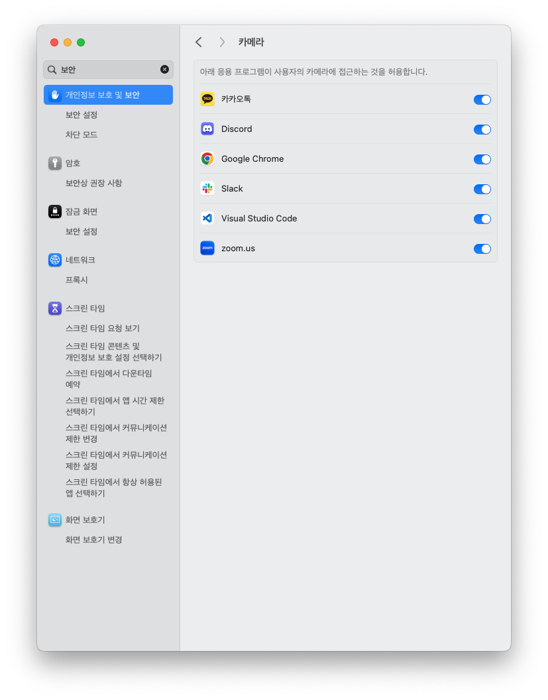
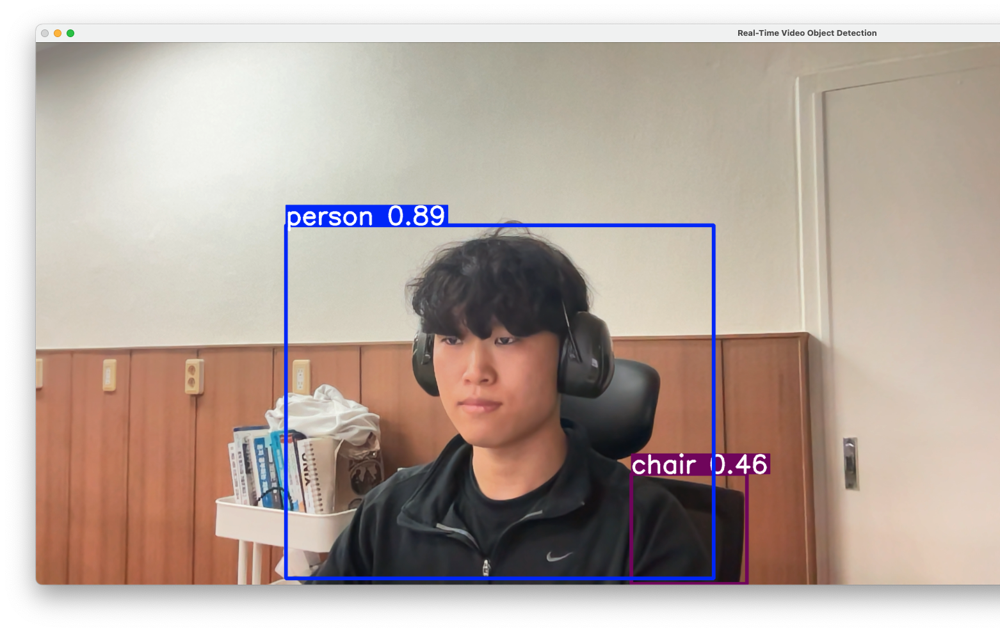
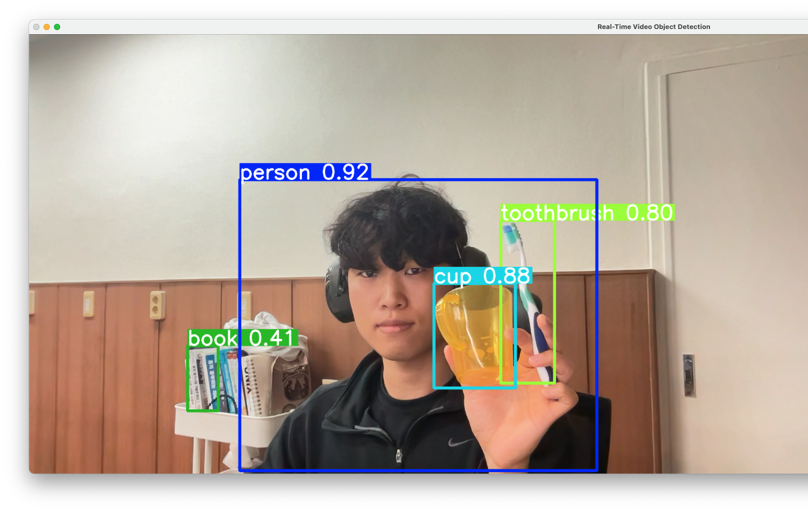

# Simple YOLO Object Detection

이번 시간에는 yolov5 모델을 사용해서 간단한 object detection 프로그램을 작성해보겠습니다. Python이 설치되어 있다는 전제 하에 진행합니다.

## 1. 개발 환경 설정

### 1) 가상 환경 설정 (권장)

우선, 프로젝트별로 패키지를 관리할 수 있도록 도와주는 파이썬 가상 환경을 생성하도록 하겠습니다.

적당한 PATH에서 VSCODE를 열고, 터미널에 아래와 같이 입력해주시면 됩니다.

```bash
# 'yolo5_env'라는 이름의 파이썬 가상환경 생성
python -m venv yolo_env

# 가상환경 활성화
# Windows:
yolo_env/Scripts/activate

# macOS:
source yolo_env/bin/activate

# 방금 생성한 파이썬 가상환경을 가리키는지 확인
which pip
```

### 2) 필요한 패키지 설치

아래 명령어를 터미널에 입력하여 필요한 패키지들을 설치합니다.

```bash
# pip install --upgrade pip
pip install torch torchvision torchaudio --index-url https://download.pytorch.org/whl/cpu
pip install opencv-python
```

### 3) YOLOv5 클론

아래 명령어를 터미널에 입력하여 YOLOv5 저장소를 클론합니다.

```bash
git clone https://github.com/ultralytics/yolov5.git
cd yolov5
pip install -r requirements.txt

# 설치가 완료되면
cd ..
```

## 2. 실시간 객체 탐지 프로그램 작성

이제 새로운 python 파일을 생성하고 아래 코드를 작성해주세요. 저는 파일 이름을 `object_detection.py`로 하겠습니다.

```bash
import torch  # PyTorch 패키지
import cv2    # OpenCV 패키지

# YOLOv5 모델 로드
# yolov5s는 YOLOv5의 경량 버전으로, CPU에서도 비교적 빠르게 동작한다
model = torch.hub.load('ultralytics/yolov5', 'yolov5s', pretrained=True)
# model.conf는 객체 탐지의 신뢰도 임계값을 설정한다. 이 값 이상일 때만 탐지 결과를 표시한다.
model.conf = 0.4

# 웹캠 초기화
cap = cv2.VideoCapture(0)  # 0은 기본 웹캠

if not cap.isOpened():
    print("웹캠을 열 수 없습니다.")
    exit()

while True:
    ret, frame = cap.read() # 실시간으로 프레임을 읽어온다
    if not ret:
        print("프레임을 읽을 수 없습니다.")
        break

    # 이미지 전처리
    img = cv2.cvtColor(frame, cv2.COLOR_BGR2RGB) # frame을 RGB로 변환한다.

    # 객체 탐지
    results = model(img) # RGB로 변환된 frame을 yolov5s 모델에 입력한다.

    # 결과를 원래 이미지에 그리기
    results.render() # 객체를 탐지한다.
    annotated_frame = results.ims[0] # 객체 탐지 결과를 frame에 그린다.

    # RGB를 BGR로 변환
    annotated_frame = cv2.cvtColor(annotated_frame, cv2.COLOR_RGB2BGR)

    # frame 출력
    cv2.imshow('Real-Time Video Object Detection', annotated_frame)

    # 'q' 키를 누르면 종료
    if cv2.waitKey(1) & 0xFF == ord('q'):
        break

# 리소스 해제
cap.release()
cv2.destroyAllWindows()
```

## 3. 코드 실행

아래 명령어를 터미널에 입력하거나, VSCODE에서 실행 버튼을 클릭하여 파이썬 파일을 실행해주세요.

```python
python object_detection.py
# 실행되기까지 시간이 걸릴 수 있음
```

### 카메라에 접근할 수 없는 경우

아래 사진과 같이 카메라 접근이 거절된 경우, 카메라 설정에서 Visual Studio Code에 대한 접근 권한을 허용해주세요.





## 4. 실행 결과!





## 5. 기타

### 가상환경 제거

가상환경은 하나의 디렉토리로 구성되어 있으므로 해당 디렉토리를 삭제하면 가상환경이 완전히 제거됩니다.

```bash
# 가상환경 비활성화
deactivate

# 가상환경 디렉토리 삭제
# Windows:
rmdir /S /Q yolov5_env

# macOS:
rm -rf yolo_env
```

### 모델 선택

yolov5s 외에도 `yolov5m`, `yolov5l`, `yolov5x` 등 다양한 크기의 모델이 있습니다. 그 중에서도 yolov5s는 상대적으로 가벼운 모델로, CPU에서도 빠르게 동작하지만, 정확도가 다소 낮을 수 있습니다. 필요에 따라 모델을 변경할 수 있습니다.

```python
model = torch.hub.load('ultralytics/yolov5', 'yolov5m', pretrained=True)
```

## 6. 더?

이번 시간에는 YOLOv5 모델을 사용해 간단한 객체 탐지 프로그램을 구현해 보았습니다. 객체 탐지 기술은 다양한 실시간 영상에서 유용하게 사용될 수 있으며, 이를 통해 여러 서비스와 응용 프로그램을 만들 수 있습니다. 아래는 객체 탐지 기술을 사용해서 만들어볼 수 있는 서비스 예시입니다.

### 1. **실시간 감시 시스템**

- 공공장소나 산업 현장에서 실시간으로 영상을 모니터링하여, 특정 객체(사람, 차량 등)의 이상 행동을 탐지하거나 물체가 특정 구역을 벗어나는지를 감시할 수 있습니다. 이는 보안 카메라 시스템에 응용될 수 있습니다.
  - https://github.com/kkobooc/DeepLearning_YOLO
  - https://velog.io/@zziyuni/yolo-v4를-이용하여-도로-위-객체-인식하기
- YOLO를 사용하여 거리 및 시간 데이터와 함께 물체의 속도를 계산할 수 있습니다. 교통 및 감시와 같은 작업에 매우 중요합니다.
  - https://docs.ultralytics.com/ko/guides/speed-estimation/#real-world-applications

### 2. **주차 시스템**

- 주차장에서 차량을 인식해 빈 주차 공간을 탐지하고, 차량의 번호판을 통해 자동 출입 시스템을 구축할 수 있습니다. 이는 주차 관리 자동화에 활용될 수 있습니다.
  - https://docs.ultralytics.com/ko/guides/parking-management/

### 3. **운동 모니터링**

- YOLO 모델을 사용한 자세 추정을 통해, 운동 모니터링을 구현할 수 있습니다. 신체의 주요 지점과 관절을 실시간으로 정확하게 추적하여 운동에 대한 평가 서비스를 만들어볼 수 있습니다.
  - https://docs.ultralytics.com/ko/guides/workouts-monitoring/#arguments-aigym

## Reference

https://github.com/ultralytics/yolov5

https://docs.ultralytics.com/ko

ChatGPT 4o
